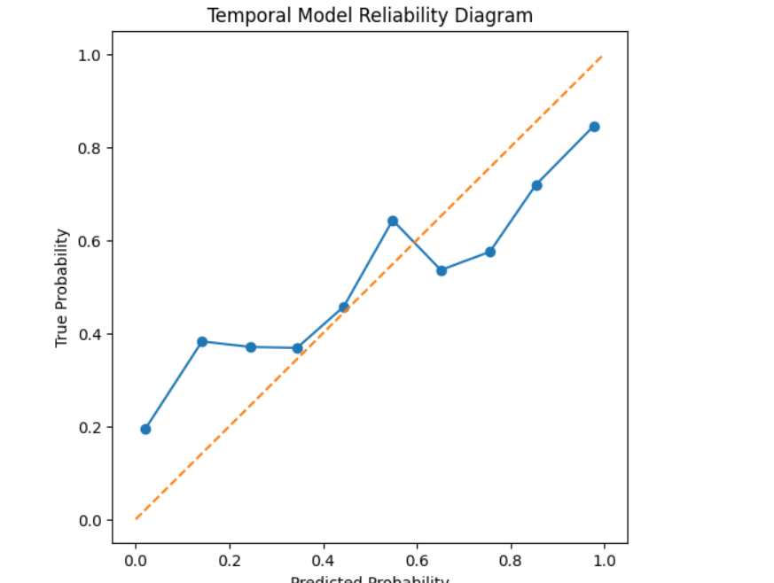
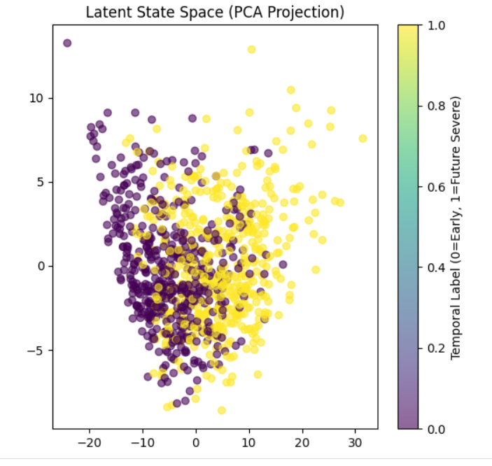
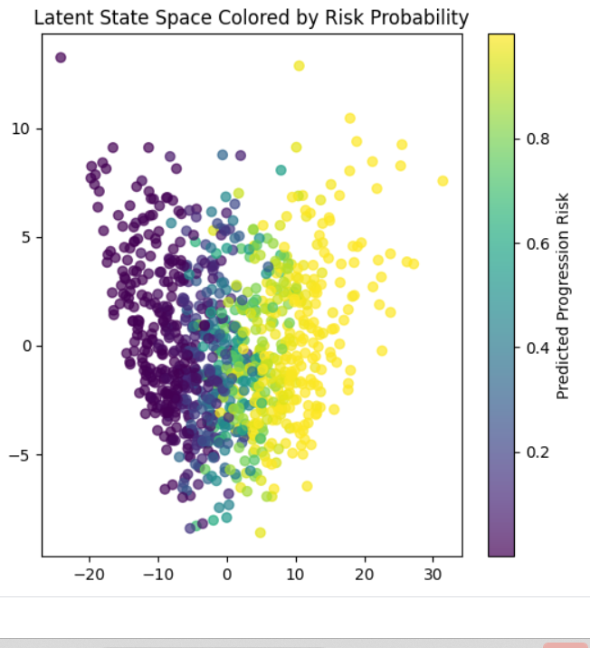
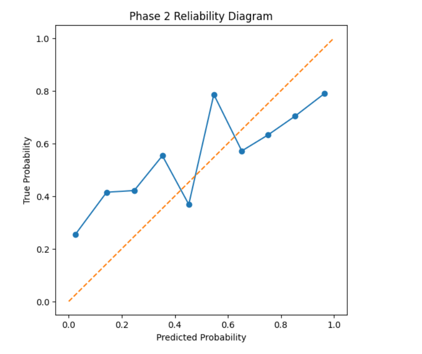

# Reliability-Aware Early Radiographic Progression Modeling

## Overview

This project develops a **reliability-aware deep learning framework** for disease severity prediction and progression modeling from chest X-rays using the RSNA Pneumonia Detection dataset.

Rather than focusing only on predictive performance, this work systematically studies:

- Calibration of model probabilities  
- Epistemic uncertainty estimation  
- Reliability under distribution shift  
- Temporal progression modeling (simulated)  
- Latent representation structure  

The project is structured in progressive phases, each increasing task difficulty and analytical depth.

---

## Project Structure

### Phase 1: Baseline Severe Risk Prediction
- Task: Predict severe vs non-severe (including normal images)
- Model: ResNet-based CNN  
- Evaluation:
  - AUROC, Brier score  
  - Calibration (ECE, reliability diagrams)  
  - Monte Carlo Dropout uncertainty  

**Insight:**  
Uncertainty strongly correlates with prediction errors in simpler classification settings.

---

### Phase 2: Pneumonia Severity Discrimination
- Task: Mild vs severe pneumonia (normal cases removed)  

**Findings:**
- Reduced AUROC compared to Phase 1  
- Increased calibration error  
- Weaker uncertainty–error separation  

**Insight:**  
Model reliability degrades as task difficulty increases.

---

### Phase 3: Reliability & Distribution Shift Analysis (Divided in 3.1 & 3.2)

#### 3.1 Uncertainty Analysis
- Monte Carlo Dropout used for epistemic uncertainty  
- Incorrect predictions exhibit higher uncertainty on average  

#### 3.2 Distribution Shift (Severity-Based)
- Train: moderate severity  
- Test: extreme severity  

**Findings:**
- Discrimination changes under shift  
- Uncertainty–error relationship degrades  

**Insight:**  
Uncertainty is not consistently reliable under distribution shift.

---

### Phase 4: Temporal Early Progression Modeling

Since real temporal data is unavailable, temporal structure is simulated:

- Severity score computed from bounding box area  
- Pneumonia cases split:
  - Bottom 40% → Early state  
  - Top 40% → Future severe state  
- Middle 20% removed  

**Task:**  
Predict progression from early state to future severe state  

**Results:**
- Temporal AUROC: ~0.82  
- Moderate calibration error (ECE ~0.15)  
- Uncertainty remains higher for incorrect predictions  
- Selective prediction experiments indicate improved accuracy under reduced coverage  

**Insight:**  
Temporal progression modeling differs from static classification but still benefits from uncertainty-aware evaluation.

---

## Latent State Analysis (Digital Twin Interpretation)

- Extracted 512-dimensional embeddings from CNN  
- Defined progression direction:

  d = μ_future − μ_early  

- Projected embeddings onto this axis  

**Findings:**
- Clear separation between early and severe states  
- Strong correlation between progression coordinate and predicted risk:

  **r ≈ 0.88**

**Interpretation:**  
The model learns a continuous disease progression structure in latent space, supporting a **probabilistic latent-state transition interpretation resembling a minimal digital twin prototype**.

---

## Figures

### Calibration (Temporal Model)

*Reliability diagram showing deviation from perfect calibration (ECE ≈ 0.15).*

---

### Latent State Space (PCA by Label)

*Latent embedding projection showing separation between early and future severe states.*

---

### Latent State Space (Risk Gradient)

*Smooth risk gradient across latent space, indicating a continuous progression structure.*

---

### Calibration (Phase 2 — Hard Task)

*Calibration degradation under increased task difficulty.*

---

## Methods Summary

- ResNet-based CNN  
- Severity-based temporal simulation  
- Monte Carlo Dropout (epistemic uncertainty)  
- Expected Calibration Error (ECE)  
- Covariate shift stress testing  
- Latent embedding analysis (PCA + projection)  

---

## Dataset Notes

- Bounding box fields (`x, y, width, height`) contain NaNs for normal cases  
- NaNs represent **absence of pneumonia**, not missing data  
- Severity computed as total bounding box area per image  

---

## Limitations

- Temporal structure is simulated (no real longitudinal data)  
- Single-step progression prediction  
- No intervention modeling  
- No patient-level longitudinal tracking  

---

## Future Work

- Apply to longitudinal datasets (e.g., MIMIC-CXR)  
- Extend to multi-step temporal modeling  
- Improve calibration under distribution shift  
- Incorporate clinical metadata  

---

## Author  
Banesori Ayekpam
